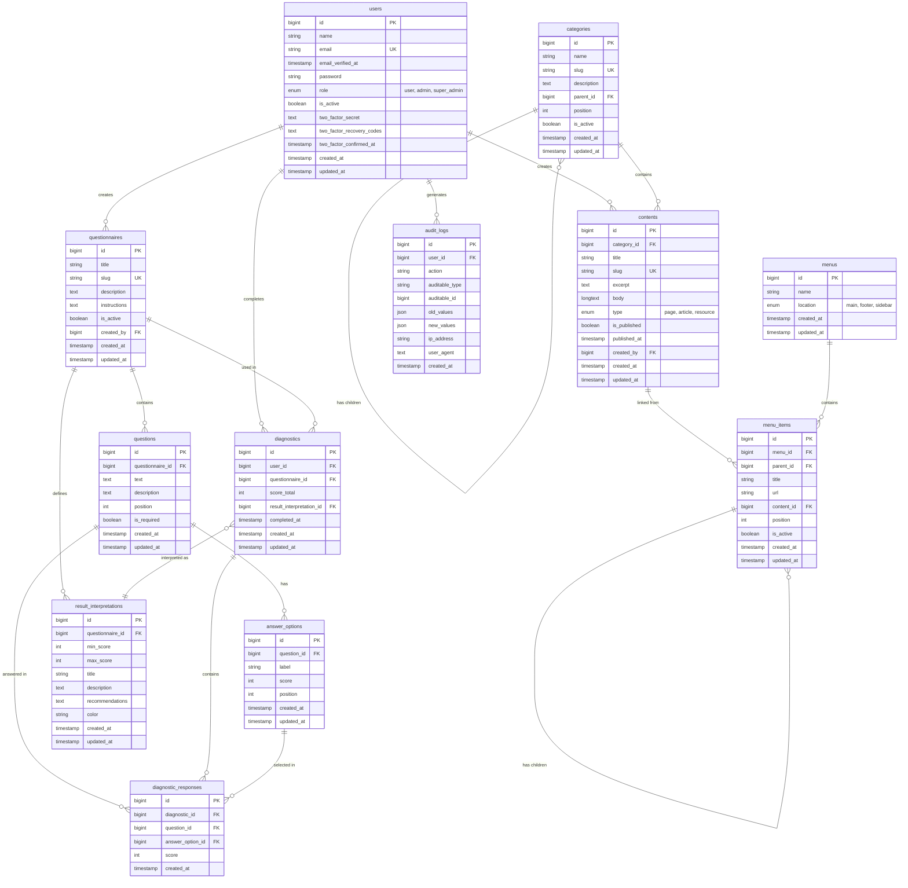
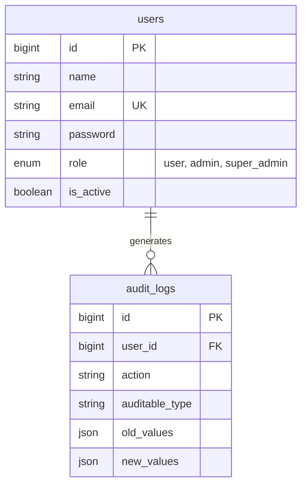
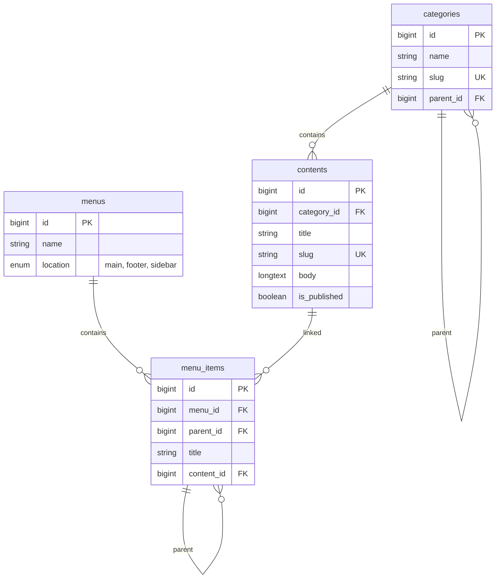
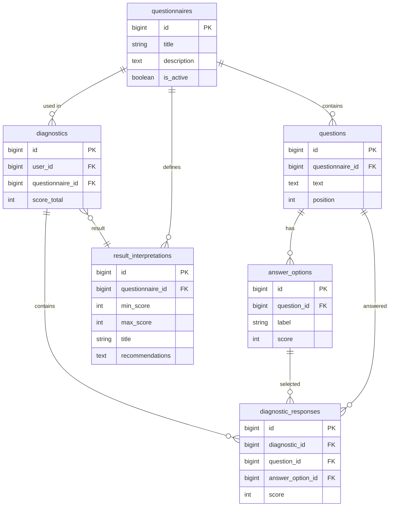
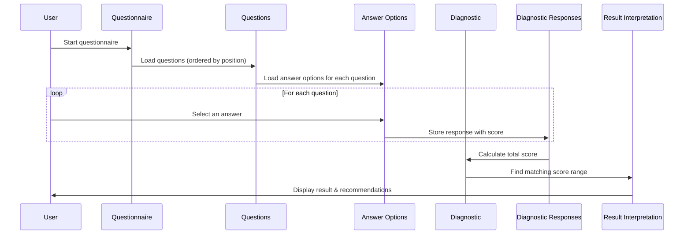

# CESIZen Database Schema

## Entity Relationship Diagram

## Simplified View by Module

### User Management

### Content Management

### Diagnostic Module (Core Feature)

## Example Data Flow

### How a Diagnostic Works

## Tables Summary

| Module | Table | Purpose |
|--------|-------|---------|
| **Users** | `users` | User accounts with roles |
| **Users** | `audit_logs` | Security logging |
| **Content** | `categories` | Content organization |
| **Content** | `contents` | Information pages |
| **Content** | `menus` | Navigation menus |
| **Content** | `menu_items` | Menu entries |
| **Diagnostic** | `questionnaires` | Stress questionnaires |
| **Diagnostic** | `questions` | Questions in questionnaire |
| **Diagnostic** | `answer_options` | Possible answers with scores |
| **Diagnostic** | `result_interpretations` | Score range meanings |
| **Diagnostic** | `diagnostics` | Completed questionnaires |
| **Diagnostic** | `diagnostic_responses` | User's answers |

## Key Improvements Over Original Schema

1. **Proper scoring system**: Questions have multiple `answer_options`, each with its own score
2. **Response tracking**: `diagnostic_responses` stores every answer the user gave
3. **Result configuration**: `result_interpretations` allows admins to define what score ranges mean
4. **Content hierarchy**: `categories` with `parent_id` for nested organization
5. **Navigation**: `menus` and `menu_items` for configurable navigation
6. **Audit trail**: `audit_logs` for RGPD compliance and security
7. **Soft delete**: `is_active` flags instead of hard deletes

## Foreign Key Cascade Rules

Cascade rules are aligned with the RGPD "right to be forgotten" decision: when a `users` row is deleted, every row that references it is hard-deleted too. Within a questionnaire, the question/option/result hierarchy cascades on parent deletion.

| Child table → parent | On parent DELETE | Reason |
|---|---|---|
| `categories.parent_id` → `categories.id` | SET NULL | Detach children, don't lose them. |
| `contents.category_id` → `categories.id` | SET NULL | Content survives category deletion. |
| `contents.created_by` → `users.id` | **CASCADE** | RGPD erasure — user's authored content is removed. |
| `menu_items.menu_id` → `menus.id` | CASCADE | A menu's items are meaningless without the menu. |
| `menu_items.parent_id` → `menu_items.id` | SET NULL | Detach children. |
| `menu_items.content_id` → `contents.id` | SET NULL | Menu item becomes a dead link, but survives. |
| `questionnaires.created_by` → `users.id` | **CASCADE** | RGPD erasure. |
| `questions.questionnaire_id` → `questionnaires.id` | CASCADE | Questions belong to one questionnaire. |
| `answer_options.question_id` → `questions.id` | CASCADE | Options belong to one question. |
| `result_interpretations.questionnaire_id` → `questionnaires.id` | CASCADE | Interpretations belong to one questionnaire. |
| `diagnostics.user_id` → `users.id` | **CASCADE** | RGPD erasure. `user_id` is NOT NULL because anonymous visitor diagnostics are never persisted. |
| `diagnostics.questionnaire_id` → `questionnaires.id` | CASCADE | If the questionnaire goes, its diagnostics go. |
| `diagnostics.result_interpretation_id` → `result_interpretations.id` | SET NULL | Keep the diagnostic + score even if the interpretation row is replaced. |
| `diagnostic_responses.diagnostic_id` → `diagnostics.id` | CASCADE | |
| `diagnostic_responses.question_id` → `questions.id` | CASCADE | |
| `diagnostic_responses.answer_option_id` → `answer_options.id` | CASCADE | |
| `audit_logs.user_id` → `users.id` | **CASCADE** | RGPD erasure. `user_id` stays nullable to allow logging failed logins where the user is unknown. |

## Deactivation Policy (`is_active`)

The schema deliberately avoids `SoftDeletes` (`deleted_at`) — the single visibility lever is `is_active`. Hard delete is reserved for super-admin cleanup tooling. Per-table semantics:

| Table | Public view (visitor / user) | Admin view |
|---|---|---|
| `users` | n/a (no public listing) | Inactive users are listed but cannot log in (`EnsureUserIsActive` middleware). Hard delete: super-admin only. |
| `categories` | Hidden when `is_active = false`. Descendants follow the parent's visibility. | All visible; toggle is a dedicated admin action. |
| `contents` | Hidden when `is_active = false` OR `is_published = false` OR `published_at` is in the future. | All visible. Publishing is separate from activation. |
| `menus` | Always rendered if a public renderer asks for `location`. (No `is_active` column.) | Manage `menu_items` directly. |
| `menu_items` | Hidden when `is_active = false`. Children of an inactive item are also hidden. | All visible. |
| `questionnaires` | Only `is_active = true` shows up in the public diagnostic picker. | All visible. |
| `questions` / `answer_options` / `result_interpretations` | No `is_active` flag — visibility follows the parent questionnaire. | Same. |

## Migration ↔ Table Mapping

| Migration file | Table created / modified |
|---|---|
| `0001_01_01_000000_create_users_table` | `users`, `password_reset_tokens`, `sessions` |
| `0001_01_01_000001_create_cache_table` | `cache`, `cache_locks` |
| `0001_01_01_000002_create_jobs_table` | `jobs`, `job_batches`, `failed_jobs` |
| `2025_08_14_170933_add_two_factor_columns_to_users_table` | `users` (+3 columns) |
| `2026_03_25_120813_create_categories_table` | `categories` |
| `2026_03_25_120818_add_role_and_is_active_to_users_table` | `users` (+2 columns) |
| `2026_03_25_120822_create_contents_table` | `contents` |
| `2026_03_25_120824_create_menus_table` | `menus` |
| `2026_03_25_120840_create_menu_items_table` | `menu_items` |
| `2026_03_25_120842_create_questionnaires_table` | `questionnaires` |
| `2026_03_25_120845_create_questions_table` | `questions` |
| `2026_03_25_120848_create_answer_options_table` | `answer_options` |
| `2026_03_25_120859_create_result_interpretations_table` | `result_interpretations` |
| `2026_03_25_120903_create_diagnostics_table` | `diagnostics` |
| `2026_03_25_120907_create_diagnostic_responses_table` | `diagnostic_responses` |
| `2026_03_25_120910_create_audit_logs_table` | `audit_logs` |
